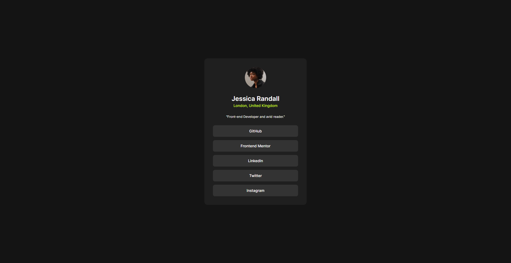

# Frontend Mentor - Social links profile solution

This is a solution to the [Social links profile challenge on Frontend Mentor](https://www.frontendmentor.io/challenges/social-links-profile-UG32l9m6dQ).

## Table of contents

- [Overview](#overview)
  - [The challenge](#the-challenge)
  - [Screenshot](#screenshot)
  - [Links](#links)
- [My process](#my-process)
  - [Built with](#built-with)
  - [What I learned](#what-i-learned)
  - [Continued development](#continued-development)
  - [Useful resources](#useful-resources)

## Overview

### The challenge

Users should be able to:

- See hover and focus states for all interactive elements on the page

### Screenshot

### Links

- Solution URL: [Github](https://github.com/Nipaaaa1/social-links-profile/)
- Live Site URL: [Github Pages](https://nipaaaa1.github.io/social-links-profile/)

## My process

### Built with

- Semantic HTML5 markup
- Mobile-first workflow
- [Svelte](https://svelte.dev/) - JS library
- [TailwindCSS](https://tailwindcss.com/) - For styles
- [Motion One](https://motion.dev/) - For Animation

### What I learned

This time, I'd try to use *Svelte* instead of React. It's actually much more simpler to use. But, I still didn't know a lot about it. Maybe because I'm using *React* too much.

I also use *Motion One* which kinda like *Framer Motion* but with vanilla Javascript. It had less features but at least I could use it with anything.

### Continued development

I'd like to try another JS Library like Vue.

### Useful resources

- [Motion One](https://motion.dev/) - The documentation of Motion One
